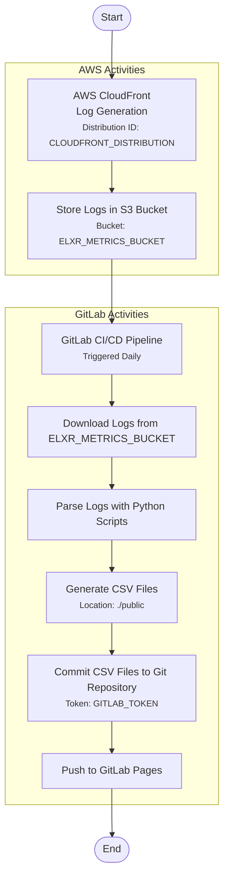

# High-Level Design Document for eLxr Metrics Collection

## Table of Contents

1. [Introduction](#introduction)
1. [Objectives](#objectives)
1. [Metrics to Collect](#metrics-to-collect)
1. [Architecture Design](#architecture-design)
   - [Data Collection Layer](#data-collection-layer)
   - [Data Processing Layer](#data-processing-layer)
   - [Data Storage Layer](#data-storage-layer)
   - [Visualization Layer](#visualization-layer)
1. [Configuration Settings](#configuration-settings)
1. [Conclusion](#conclusion)
1. [Appendices](#appendices)

______________________________________________________________________

## Introduction

This document outlines the high-level design for the metrics collection system of [the eLxr Website](https://elxr.org). The system leverages AWS CloudFront logs, GitLab CI/CD pipelines, Python scripts, and a JavaScript-based frontend to collect, process, store, and visualize key metrics. The overall data flow can be illustrated as following:

## Objectives

- **Accurate Data Collection:** Reliably collect metrics using CloudFront standard logs.
- **Automated Processing:** Utilize GitLab CI/CD pipelines to automate log retrieval and processing.
- **Scalable Storage:** Store processed metrics in CSV format within a Git repository.
- **User-Friendly Visualization:** Present metrics through an interactive JavaScript dashboard using Chart.js.
- **Data Accessibility:** Provide raw CSV files for download and reference.

## Metrics to Collect

1. **Total View Count**
   The cumulative number of page views across the elxr website in every 6 hour interval.

1. **Unique User Count**
   The number of distinct users visiting the website in every 6 hour interval.

1. **Total eLxr Package Downloads**
   The total number of eLxr package downloads.

## Architecture Design

### Data Collection Layer

CloudFront is configured to generate standard logs containing detailed information about each request to elxr website and mirror website. It serve as the primary data source for collecting metrics related to page views, unique users, and package downloads.

### Data Processing Layer

A scheduled GitLab CI/CD pipeline runs daily to automate the retrieval and processing of CloudFront logs. It downloads the latest CloudFront logs, parses them using Python scripts, and generates CSV reports in [public](./public/) folder.

- [elxr_org_view.csv](./public/elxr_org_view.csv): time sequence of elxr website view count, and unique user count
- [package_stats.csv](./public/package_stats.csv): package downloads table sorted by download count
- [package_top_10.csv](./public/package_top_10.csv): top 10 most download packages sorted by download count

Custom [Python scripts](./src/elxr_metrics/) parse CloudFront log files to extract relevant metrics. The scrptis analyze logs to compute total views, unique users, and eLxr package download counts, then save results as CSV files in [public](./public/) folder.

### Data Storage Layer

- **Git Repository:**
  Processed CSV files are stored in a Git repository in [public](./public/) folder. Version control for metrics data, enabling historical tracking and data accessibility.

- **GitLab Pages:**
  [GitLab Pages](https://elxr-metrics-d8932f.gitlab.io/) serves the stored CSV files and the frontend dashboard. Pages host the visualization dashboard and provide access to raw metrics data for download.

### Visualization Layer

Pure JavaScript with Chart.js. It displays interactive charts and graphs representing the collected metrics. Users can view trends and download raw CSV files.

## Configuration Settings

To accommodate the gitLab CI/CD pipeline, ensure the following environment variables are set in GitLab CI/CD pipeline:

- `CLOUDFRONT_DISTRIBUTION`: The CloudFront distribution ID exposing the eLxr Website.
- `ELXR_METRICS_BUCKET`: The S3 bucket where CloudFront standard log files are stored.
- `GITLAB_TOKEN`: A Project Access Token (PAT) with appropriate permissions for pushing commits.
- `S3_BUCKET`: The S3 bucket that hosts the eLxr Website content.

These variables should be defined in the GitLab project settings under **Settings > CI/CD > Variables** and should be marked as **Protected** and **Masked** since they contain sensitive information.

## Conclusion

This high-level design document provides a comprehensive overview of the metrics collection system for the eLxr Website. By leveraging AWS CloudFront logs, GitLab CI/CD pipelines, Python processing scripts, and a JavaScript-based frontend with Chart.js, the system ensures accurate data collection, automated processing, scalable storage, and user-friendly visualization. Incorporating the specified configuration variables (`CLOUDFRONT_DISTRIBUTION`, `ELXR_METRICS_BUCKET`, `GITLAB_TOKEN`, `S3_BUCKET`) ensures seamless integration and operation.

## Appendices

### Appendix A: Glossary

- **CI/CD:** Continuous Integration/Continuous Deployment
- **AWS S3:** Amazon Web Services Simple Storage Service
- **CloudFront:** AWS Content Delivery Network (CDN) service
- **CSV:** Comma-Separated Values

### Appendix B: References

- [AWS CloudFront Logging](https://docs.aws.amazon.com/AmazonCloudFront/latest/DeveloperGuide/AccessLogs.html)
- [GitLab CI/CD Documentation](https://docs.gitlab.com/ee/ci/)
- [Chart.js Documentation](https://www.chartjs.org/docs/latest/)
- [GitLab Pages Documentation](https://docs.gitlab.com/ee/user/project/pages/)
